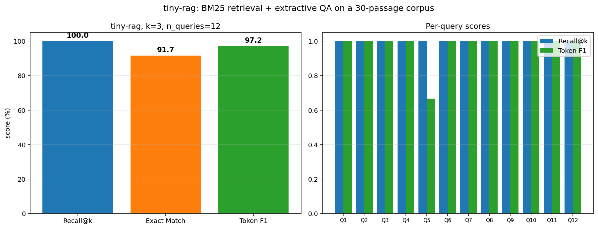

# tiny-rag

A minimal retrieval-augmented question-answering pipeline: BM25 over a 30-passage corpus, then an 80 MB extractive QA head.

   



## What it does

Takes a natural-language question, retrieves the most relevant passages from a small hand-curated corpus with BM25, then extracts the answer span from the top passages using a pretrained question-answering model. Returns the answer with the best confidence across the retrieved passages.

## Why it matters

RAG is the standard recipe behind almost every production "chat over your docs" system. This repo strips it down to the essential pieces so the moving parts stay visible:

- the retriever is BM25 (no training, no embedding model).
- the QA head is a pretrained 80 MB extractive model (no fine-tuning).
- the corpus is 30 hand-written passages bundled with the repo (no dataset download).
- the eval is 12 hand-crafted question-answer pairs with gold passage ids.

You can read the whole pipeline in five files (`src/corpus.py`, `src/retriever.py`, `src/qa.py`, `src/pipeline.py`, `src/eval.py`).

## How it works

1. **Corpus** (`src/corpus.py`): 30 short factual passages about ML, NLP, IR, and adjacent topics.
2. **Retriever** (`src/retriever.py`): BM25 (`rank-bm25`) over whitespace-tokenized lowercased text.
3. **Extractive QA** (`src/qa.py`): `deepset/tinyroberta-squad2` (~80 MB) loaded with `AutoModelForQuestionAnswering`. Span extraction is done manually with masked start/end logits (the older `pipeline("question-answering", ...)` was removed from the transformers pipeline registry in recent releases).
4. **RAG pipeline** (`src/pipeline.py`): retrieve top-k, ask QA on each, return the answer with the highest model confidence.
5. **Eval** (`src/eval.py`): retrieval recall@k against gold passage ids, plus SQuAD-style exact match and token F1.

## Quickstart

```bash
git clone https://github.com/Mathos34/tiny-rag
cd tiny-rag
python -m venv .venv && source .venv/bin/activate   # or .venv\Scripts\activate on Windows
pip install torch --index-url https://download.pytorch.org/whl/cpu
pip install transformers rank-bm25 numpy matplotlib
python train.py
python scripts/make_viz.py
```

End-to-end run is about 30 seconds after the first model download (the QA model is ~80 MB and is cached by the transformers library).

## Results

12 questions, k=3 retrieved passages per query, evaluated against gold passage ids and gold answer strings.

| Metric | Value |
|---|---|
| Mean retrieval Recall@3 | **100.0%** |
| Mean Exact Match | **91.7%** (11 of 12) |
| Mean Token F1 | **97.2%** |

The one non-exact match is on "Who introduced ResNet?" where the model answers "He et al. at Microsoft Research" (the gold is "He et al."). Token F1 on that example is 0.67, so the answer is still mostly right; the eval is just strict about extra words.

Caveat: 30 passages and 12 questions is a toy. The point is the pipeline shape and the metric harness, not the scoreboard.

## References

- Robertson and Sparck Jones, *Okapi at TREC*, 1995.
- Karpukhin et al., *Dense Passage Retrieval for Open-Domain Question Answering*, EMNLP 2020.
- Lewis et al., *Retrieval-Augmented Generation for Knowledge-Intensive NLP Tasks*, NeurIPS 2020.
- Rajpurkar et al., *Know What You Don't Know: Unanswerable Questions for SQuAD*, ACL 2018 (SQuAD 2.0; the QA head used here was fine-tuned on it).

## About

Built by Mathis Lacombe, AI Maker at the [Intelligence Lab](https://www.ece.fr/intelligence-lab/), ECE Paris.
[LinkedIn](https://www.linkedin.com/in/mathis-lacombe34/) · [Hugging Face](https://huggingface.co/Mathos34400)
